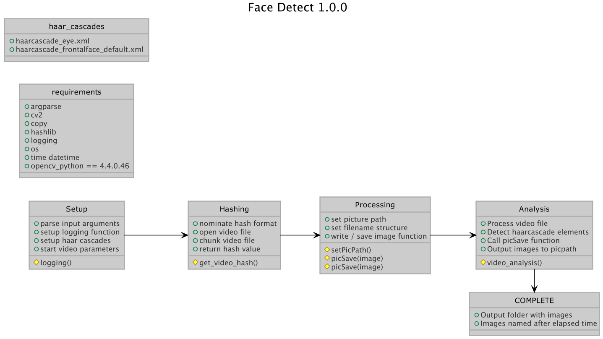

# faceDetect
## Python script for detecting human faces from webcam or similar connected camera

Version 0.1 November 2020.

Python program to extract human faces detected from a supplied video file. Utilises opencv for facial detection  
Tested successfully with .mp4, .avi and .mov files

Produces: 

- Folder created named faces_detected (video file name) elapsed time of image in video file 
- Images taken of faces in folder with video file name based on the time interval set by user, saved with date of image taken
- Log of dates / times of execution of the program (event.log) with hash of the video file

Example usage:  

python3 facedetectfromVid.py -f myvideo.avi -i 2

-f for video file
-i for interval. If set to 1, an image will be taken then 1 second will elapse.  From testing 1 second is the ideal time lapse to prevent uncessary shots being taken whilst still getting sufficient data.  

## Licence:

MIT Licence

G3Dx5 November 2020 
